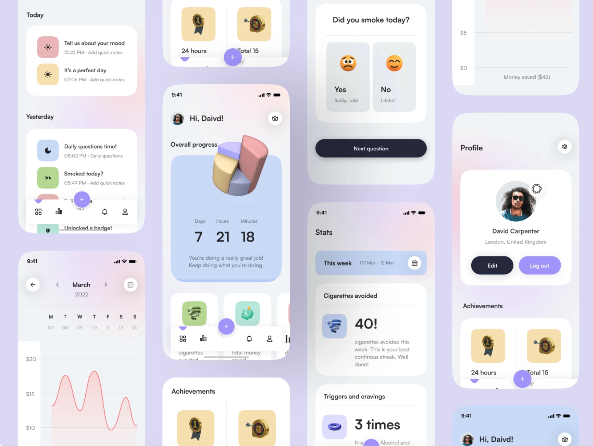
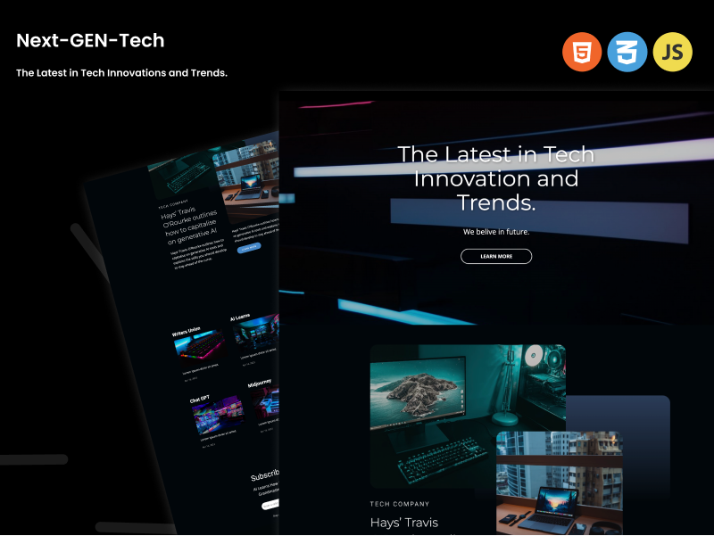

<!--

  

 -->

  

  <!-- Typing SVG by DenverCoder1 - https://github.com/DenverCoder1/readme-typing-svg -->
  

### Expert App Developer.
Young Enthusiast self-taught developer who is giving his every minute of life in developing something great and useful.  with 3+ years of work experience in building industry ready futuristic pixel perfect apps. https://mayankchoudhary.com

  
  
  
  
  
  
  
    
   
     
 
  <!-- Add more images as needed -->

<!-- 

  

 -->

## Languages, tools and skills

<!--  -->

### Get in touch 🤝

[][linkedIn]

 
 

<!--  -->

[linkedIn]: https://www.linkedin.com/in/mayank--choudhary/ 
